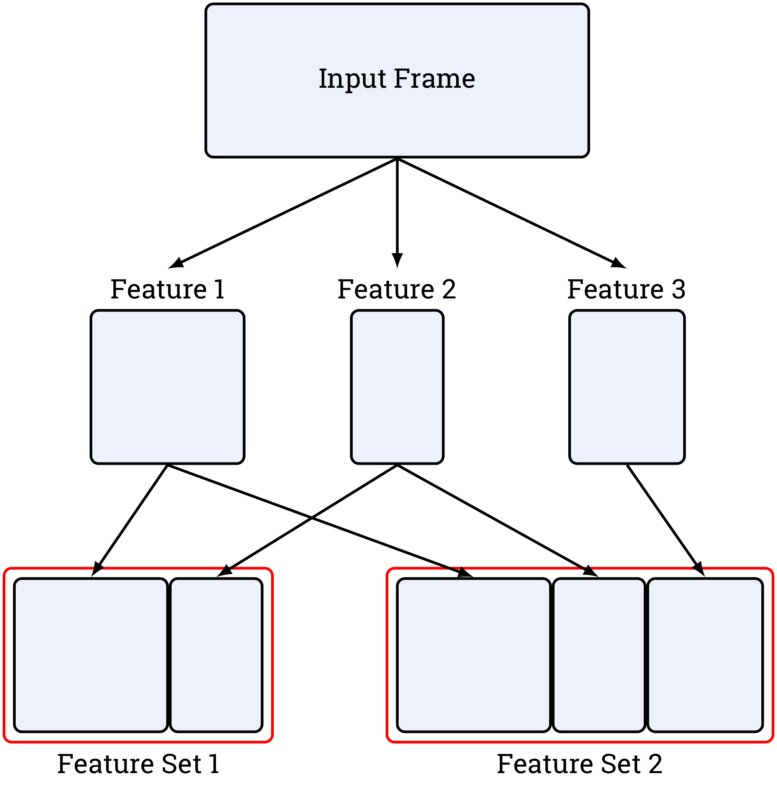

# Overview

## Modular Feature Engineering

**Define features as independent blocks to organize your projects.**



## Source Code Tracking

**Track source code of every feature and experiment to make each of them reproducible.**


## Parallel Computing and Caching

**Compute independent features in parallel. Cache them to avoid repeated computations.** 


## Experiment Tracking

**Track your progress with local leaderboards.** 


## Feature Selection

**Compute feature importances and select features from any experiment with `experiment.feature_importances()` and `experiment.select()`.**


## Easy Stacking

**Design stacked ensembles of any complexity with `stl.stack()`.**

## Safe Validation

**Compute stateful features, such as target encoding, after CV split to avoid target leakage.**

## End-to-end Experiment Inference

**Automatically compute all your features and run models just with `experiment.predict(test_frame).`**

## Interactivity and Rich Reports

**Monitor the progress of everything going on in KTS with our interactive reports. From model fitting to computing feature importances.** 


## Clean API

Features are defined as decorated functions. Then they are collected into features sets. Features may save state between training and inference stages. They can also be nested, i.e. use other features inside. In case of possible target leakage, stateful feature can be computed after CV split.

```python
@feature
def simple_feature(df):
    res = stl.empty_like(df)
    res['c'] = df['a'] - df['b']
    res['d'] = df['a'] * df['b']
    return res
   
from somelib import Encoder

@feature
def stateful_feature(df):
    res = simple_feature(df)
    if df.train:
        enc = Encoder()
        res = enc.fit_transform(...)
        df.state['enc'] = enc
    else:
        enc = df.state['enc']
        res = enc.transform(...)
    ...
    return res 
    
fs = FeatureSet(before_split=[simple_feature], 
                after_split=[stateful_feature],
                train_frame=train,
                targets='Survived')
```



KTS provides wrappers for most frequently used models for regression and binary and multiclass classification tasks. Other models can also be easily wrapped.

```python
from kts.models import binary

model = binary.CatBoostClassifier(rsm=0.2)
```



Validation strategies are defined by splitter and metric. In more advanced cases you can subclass Validator and define your own validation strategy using auxiliary data \(e.g. time series or groups for either splitting or evaluation\).

```python
from sklearn.metrics import roc_auc_score
from sklearn.model_selection import StratifiedKFold

skf = StratifiedKFold(5, True, 42)
val = Validator(skf, roc_auc_score)

summary = val.score(model, fs)
exp_id = summary['id']
```



Stacking is easy with `stl.stack` that behaves as an ordinary feature and can be simply added to any feature set. To avoid target leakage, use noise or special splitters.

```python
val_splitter = ...
val_stack = Validator(val_splitter, roc_auc_score)

model_stack = binary.LogisticRegression(C=10)
fs_stack = FeatureSet([..., stl.stack(exp_id)], ...)

summary_stack = val_stack.score(model_stack, fs_stack)
stack_id = summary_stack['id']
```



Any experiment, even stacked, automatically computes all its features and runs all models. All you need is `experiment.predict(test_frame)`.

```python
model = leaderboard[exp_id]
model_stack = leaderboard[stack_id]

model.predict(test_frame)
model_stack.predict(test_frame)
```

## Get started

Start exploring KTS with our tutorials:



